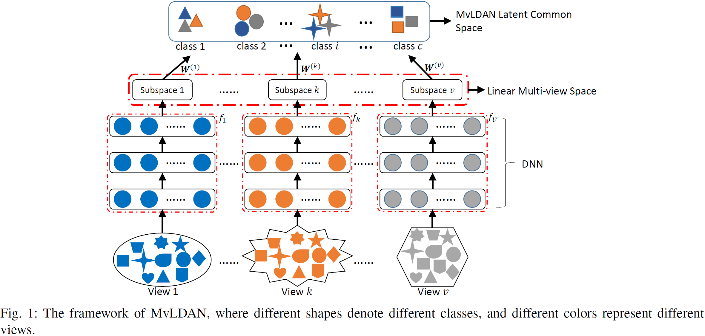
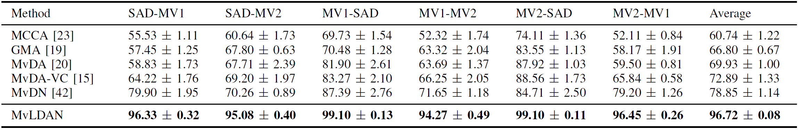
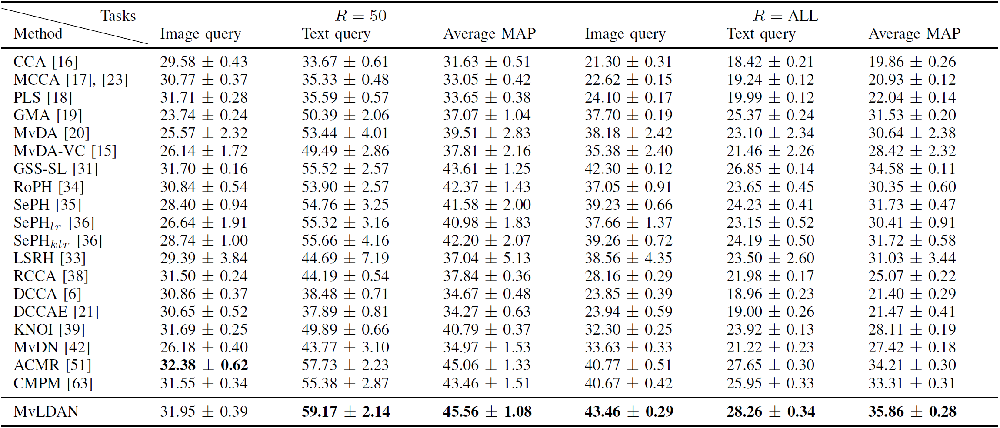

# MvLDAN
Peng Hu, Dezhong Peng, Yongsheng Sang, Yong Xiang, [Multi-view linear discriminant analysis network](https://ieeexplore.ieee.org/document/8704986)[J]. IEEE Transaction on Image Processing (TIP), Online Early Access, 2019. (Keras&Theano Code)

## Abstract
In many real-world applications, an object can be described from multiple views or styles, leading to the emerging multi-view analysis. To eliminate the complicated (usually highly nonlinear) view discrepancy for favorable cross-view recognition and retrieval, we propose a Multi-view Linear Discriminant Analysis Network (MvLDAN) by seeking a nonlinear discriminant and view-invariant representation shared among multiple views. Unlike existing multi-view methods which directly learn a common space to reduce the view gap, our MvLDAN employs multiple feedforward neural networks (one for each view) and a novel eigenvalue-based multi-view objective function to encapsulate as much discriminative variance as possible into all the available common feature dimensions. With the proposed objective function, the MvLDAN could produce representations possessing: a) low variance within the same class regardless of view discrepancy, b) high variance between different classes regardless of view discrepancy, and c) high covariance between any two views. In brief, in the learned multi-view space, the obtained deep features can be projected into a latent common space in which the samples from the same class are as close to each other as possible (even though they are from different views), and the samples from different classes are as far from each other as possible (even though they are from the same view). The effectiveness of the proposed method is verified by extensive experiments carried out on five databases, in comparison with 19 state-of-the-art approaches.

## Framework


<!--## Result
-->
## Result
The mean verification rate and standard error on the nMSAD dataset.


Performance comparison in terms of mean MAP@R scores and standard error (percent) on the NUS-WIDE
dataset.


## Citing MvLDAN
If you find MvLDAN useful in your research, please consider citing:
```
@ARTICLE{Hu2019MvLDAN, 
  author={Hu, Peng and Peng, Dezhong and Sang, Yongsheng and Xiang, Yong}, 
  journal={IEEE Transactions on Image Processing}, 
  title={Multi-view Linear Discriminant Analysis Network}, 
  year={2019},
  volume={28},
  number={11},
  pages={5352-5365},
  doi={10.1109/TIP.2019.2913511}, 
  ISSN={1057-7149}, 
  month={Nov},
}
```
